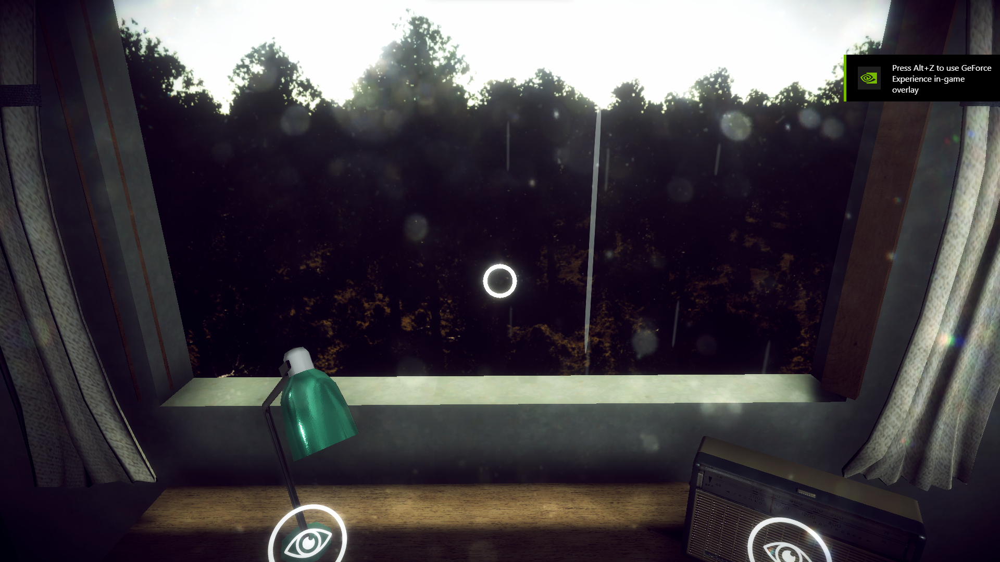
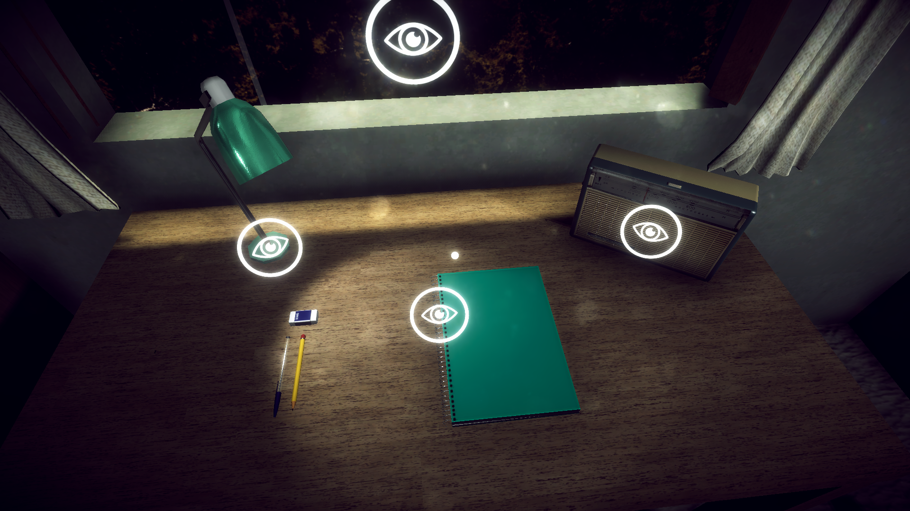
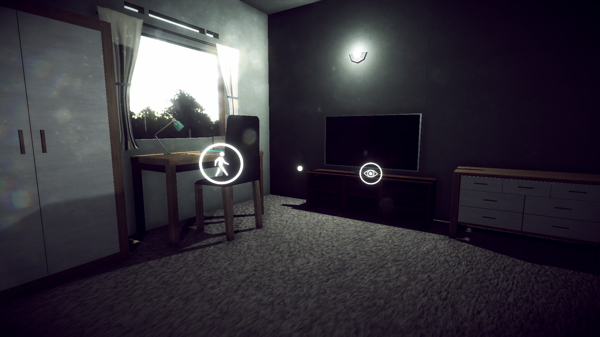

<!-- ABOUT THE PROJECT -->
<h1 align="center">The Room - VR Simulation</h1> 

<h5 align="center">
Repository For The Room - VR Simulation
</h5>

Game Project for Final Exam in 6th Semesters Amikom Yogyakarta University. The Room VR Simulation is a virtual reality game in which we as students are in a room and interact with the action that is around it.

## Built with

- [Unity](https://unity.com/)
- [FMOD](https://www.fmod.com/)
- [Google_VR](https://developers.google.com/vr/develop/unity/get-started-android)

### Demo

  

  

  

## Getting Started

### Prerequisites

There are several conditions before you can clone this project:
* [Unity](https://unity.com/)
* [Github Api Key](https://github.com/settings/tokens)

### Installation

Creating a token (if you didn't have yet) by reading [this documentation](https://docs.github.com/en/authentication/keeping-your-account-and-data-secure/creating-a-personal-access-token). When done, follow the steps below:
1. Clone the repo https://github.com/FikranAkbar/The_Room-VR_Simulation.git
2. Build the project
3. And you're good to go.

<!-- CONTRIBUTING -->
## Contributing

Contributions are what make the open source community such an amazing place to be learn, inspire, and create. Any contributions you make are **greatly appreciated**.

1. Fork the Project
2. Create your Feature Branch (`git checkout -b feature/AmazingFeature`)
3. Commit your Changes (`git commit -m 'Add some AmazingFeature'`)
4. Push to the Branch (`git push origin feature/AmazingFeature`)
5. Open a Pull Request

<!-- CONTACT -->
## Contact

Gmail - fikranakbar756@gmail.com
Linkedin - [Fikran Akbar](https://www.linkedin.com/in/fikran-akbar-1ab958169/)
